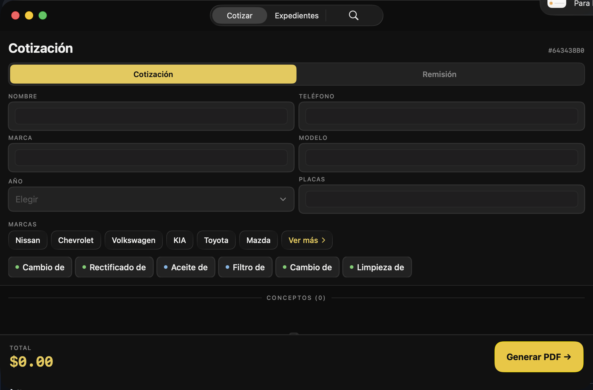
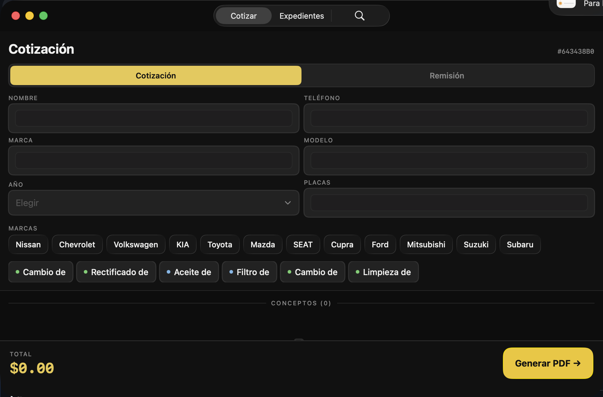
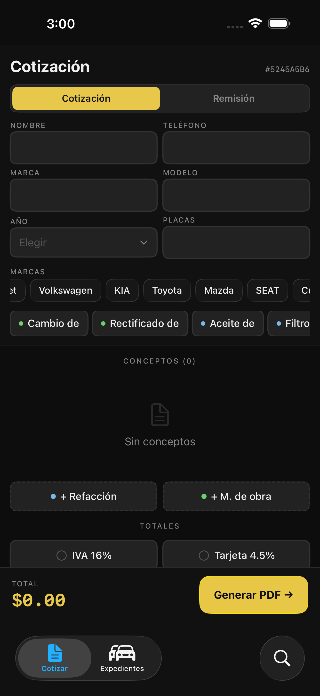
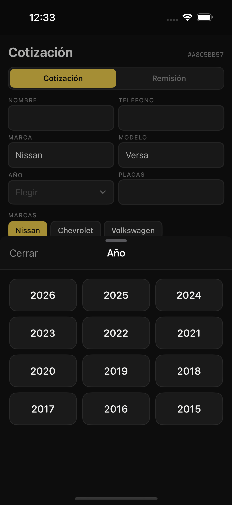
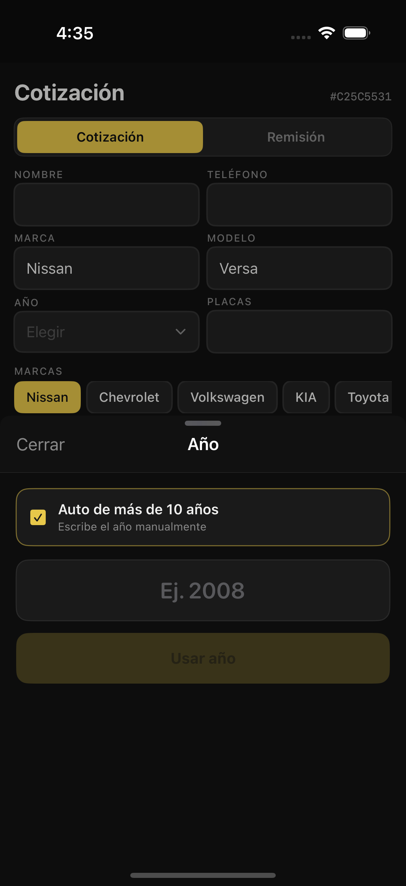
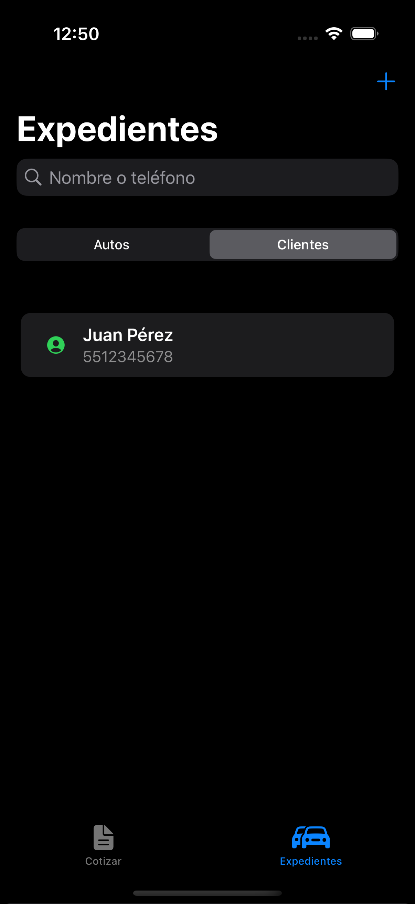
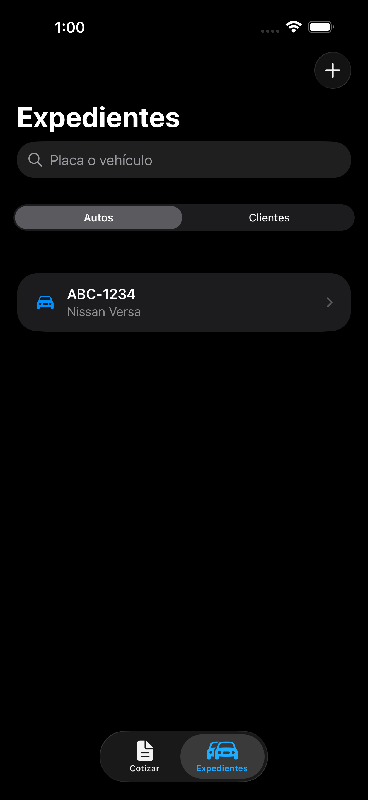
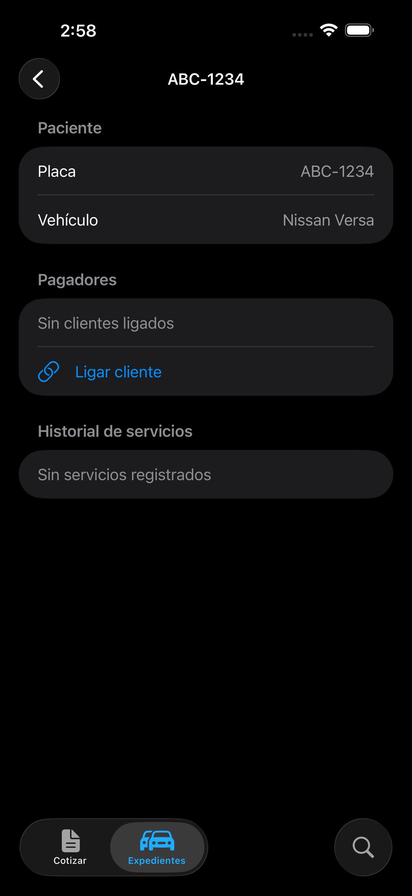
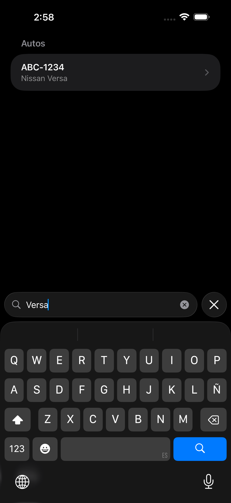

# Capturas de features

## macOS nativo (no Catalyst)

La misma base de código corre nativa en macOS 15+ con Liquid Glass en macOS 26.
Los pills de marca y el chip "Ver más" funcionan igual que en iOS.

### "Ver más" expandido (12 marcas) en macOS

Capturas reales del simulador (iPhone 16) generadas por
`MaximusPrecisionUITests/ScreenshotTests.swift`.

## Catálogo de vehículos (SwiftData + LRU cache)

### Pills de marca / modelo

### "Ver más" — lista completa de marcas (12)

### Versión opcional (sheet)

### Año (picker)

### Año fuera de rango — "Más de 10 años" (entrada manual)

### Cotización con marca/modelo elegidos

## IVA, comisión por tarjeta y tipo de documento

### IVA 16%

### Comisión por tarjeta 4.5%

### Nota de remisión

### PDF generado

## Expedientes: clientes y autos (SwiftData)

El **auto es el paciente** (entidad central con su historial); el **cliente es
quien paga** (no exclusivo, puede transferirse el auto). Las cotizaciones se
guardan como servicios en el expediente del auto.

### Clientes

### Autos (pacientes)

### Expediente del auto (pagadores + historial)

### Búsqueda en el tab bar (Liquid Glass, iOS 26)

