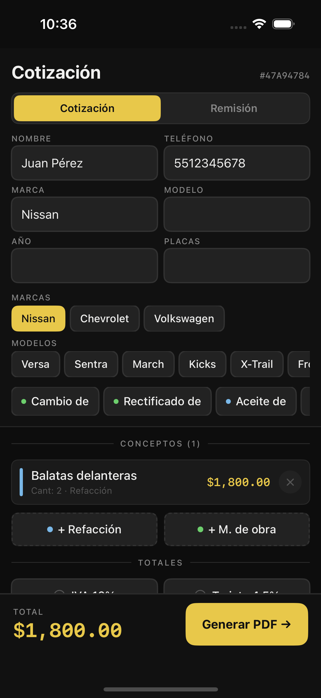
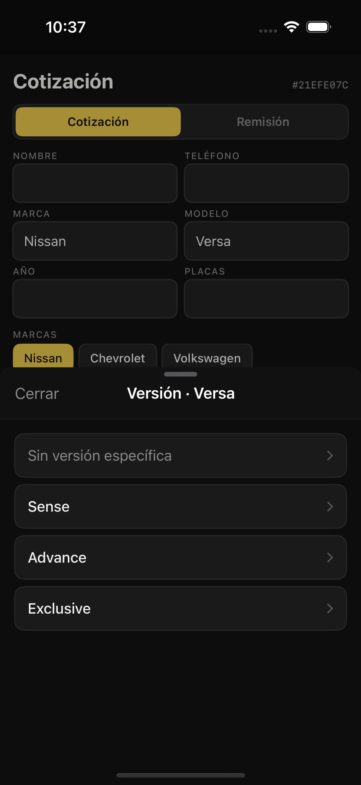
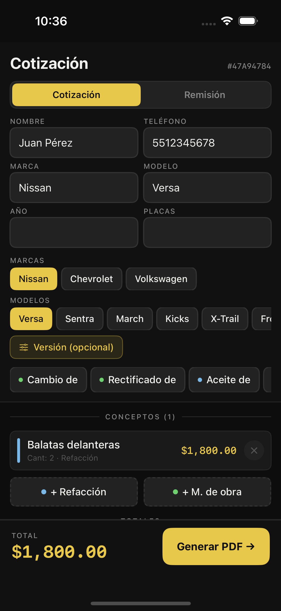
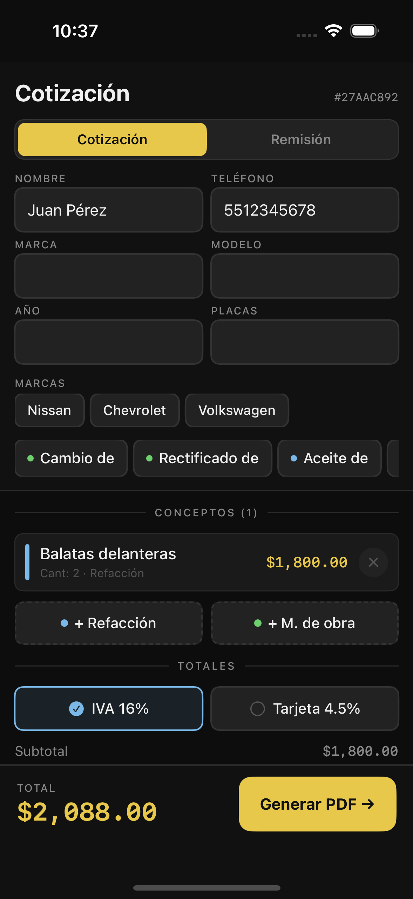
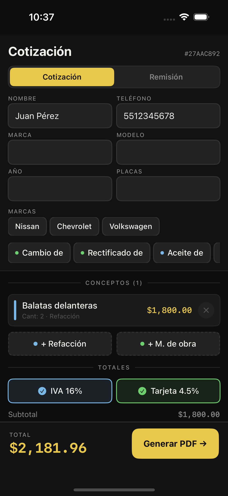
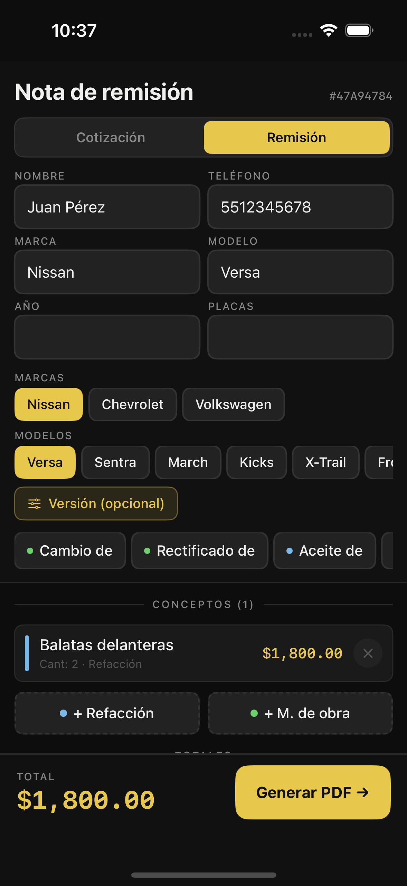
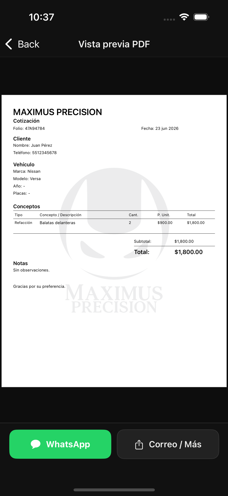

# Capturas de features

Capturas reales del simulador (iPhone 16) generadas por
`MaximusPrecisionUITests/ScreenshotTests.swift`.

## Catálogo de vehículos (SwiftData + LRU cache)

### Pills de marca / modelo

### Versión opcional (sheet)

### Cotización con marca/modelo elegidos

## IVA, comisión por tarjeta y tipo de documento

### IVA 16%

### Comisión por tarjeta 4.5%

### Nota de remisión

### PDF generado

